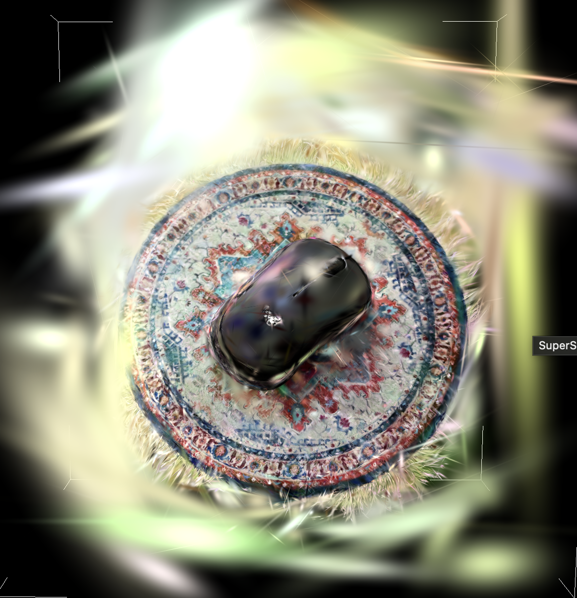

# 3D Gaussian Splatting Scene Reconstruction

A complete 3D Gaussian Splatting (3DGS) reconstruction pipeline
built using a custom dataset captured with an iPhone 15.

## Pipeline

The pipeline covers:

- Image capture using an iPhone 15
- Camera pose estimation and sparse reconstruction with COLMAP
- 3D Gaussian Splatting training with OpenSplat
- Visualization and post-processing with SuperSplat

## Results

The pipeline reconstructed a real-world scene from 115 captured images,
producing a final model containing 199,545 Gaussian primitives.

### Reconstruction

### Before and After Post-processing

## Hardware

- Apple MacBook Air (M1, 8 GB RAM)
- iPhone 15

## Software

- COLMAP 4.0.4
- OpenSplat 1.1.5
- SuperSplat Editor 2.27.3
- macOS Tahoe 26.3

## Training

- Images: 115
- Iterations: 7,000
- Backend: CPU
- Downscale factor: 2
- Training time: approximately 33 hours
- Final Gaussian primitives: 199,545

## Project Report

[Read the full project report](ARVR_project_report.pdf)
